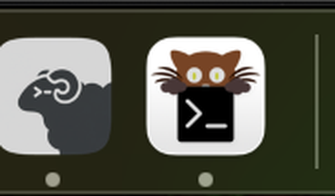

# sheepdock

A native macOS launcher that opens [herdr](https://herdr.dev) in its own
[kitty](https://sw.kovidgoyal.net/kitty/) window — with its own Dock icon.



Left: herdr, launched by sheepdock. Right: a kitty window you started yourself.
Two apps, two icons, one kitty installation.

**Windows:** the same trick with a branded, unpackaged copy of Windows Terminal
lives in [`windows/`](windows/README.md). No admin rights needed.

## Why

On Linux this is a one-liner: start kitty with `--class herdr`, add a matching
`StartupWMClass=` to a `.desktop` file, and the window manager gives that window
its own icon. macOS has no `WM_CLASS`. The Dock icon comes from the application
bundle, so anything launched out of `kitty.app` is kitty, icon included.

kitty does offer custom icons, and the obvious route looks promising: drop a
`kitty.app.icns` into a config directory and point `KITTY_CONFIG_DIRECTORY` at
it per launch. It genuinely works — for about a second. Under the hood kitty
writes the icon as an `Icon\r` file **onto `/Applications/kitty.app` itself**,
where it applies globally and permanently. Your plain kitty ends up as a sheep
in Finder. Calling `cocoa_set_app_icon` from a kitty watcher does the same
thing, and the artifact cannot be deleted while kitty runs without the Dock
refreshing straight back to the bundle's icon.

The only clean way to get a per-app icon on macOS is a separate app bundle.
sheepdock builds one — without duplicating kitty.

## What you get

`~/Applications/herdr.app`, roughly **1 MB**, containing:

- its own `Info.plist`, so the app is called herdr and carries the herdr icon
  (the menu bar says "herdr", not "kitty")
- a real copy of kitty's launcher binary — only 446 KB of the 157 MB bundle
- symlinks into `kitty.app` for everything heavy: `kitten`, `Frameworks`,
  `Resources/Python`, `doc`, and friends

Because the bulk is symlinked rather than copied, a `brew upgrade` of kitty
carries straight over, and the bundle costs ~1 MB instead of ~157 MB.

## Requirements

- macOS 11 or newer
- [kitty](https://sw.kovidgoyal.net/kitty/) — `brew install --cask kitty`
- [herdr](https://herdr.dev) on your `PATH`
- Pillow, optional — only for the rounded macOS icon mask
  (`pip3 install Pillow`); without it you get a square icon

## Install

```sh
git clone https://github.com/ralfkuh-lab/sheepdock.git
cd sheepdock
./install.sh
```

Then launch herdr from Finder, Spotlight or Launchpad, or drag it to the Dock.

Options:

| Flag | Meaning |
| --- | --- |
| `--prefix DIR` | install somewhere other than `~/Applications` |
| `--icon SRC` | use a different logo (URL or local image) |
| `--no-mask` | keep the icon square instead of applying the squircle |
| `--force` | replace an existing kitty profile in the config directory |

`KITTY_APP=/path/to/kitty.app ./install.sh` overrides kitty detection.

## How it works

The launcher script inside the bundle ends with:

```sh
exec "$HERE/kitty" --title herdr "$HERDR" "$@"
```

`$HERE/kitty` is the copy **inside herdr.app**. That puts the running process's
executable path inside this bundle, so macOS attributes it to this bundle and
draws this bundle's icon in the Dock. `/Applications/kitty.app` is never
consulted for identity and never modified.

Three details the script handles that are easy to trip over:

**herdr refuses to run nested.** Launched from inside a herdr pane, the process
inherits that pane's `HERDR_*` variables and herdr aborts with *"nested herdr is
disabled by default"*. A new window is not nesting, so the launcher drops those
inherited markers. From Finder there is nothing to drop.

**`globinclude` only takes relative patterns.** The bundled kitty profile
inherits your normal config with `globinclude ../kitty/kitty.conf`. An absolute
path or `~` raises `NotImplementedError: Non-relative patterns are unsupported`.
`globinclude` rather than `include` so a missing file is not an error.

**The copied binary has to keep up with kitty.** After a kitty upgrade the
446 KB copy no longer matches the symlinked resources. On each launch the script
compares a checksum of the *original* against the one recorded when it was
copied, and re-copies if they differ. It deliberately does not compare the files
themselves: ad-hoc re-signing alters the copy, so a byte comparison would
re-copy on every single launch.

## What it does not touch

`/Applications/kitty.app` is left completely alone — no `Icon\r`, no
`FinderInfo` attribute, signature intact. Removing herdr.app leaves no trace on
your kitty installation. Your own `~/.config/kitty/kitty.conf` is inherited, not
modified.

## Configuration

`~/.config/herdr-kitty/` holds two files:

- `kitty.conf` — the profile used only by herdr.app. Inherits your normal kitty
  config, then adds `macos_quit_when_last_window_closed yes`.
- `launcher.env` — sourced before herdr starts, for extra `PATH` entries or
  environment variables. Never overwritten by `install.sh`.

GUI apps inherit only a minimal `PATH`, so if your agent CLIs live somewhere
unusual, add them there:

```sh
export PATH="$HOME/.grok/bin:$PATH"
```

Arguments reach herdr, so a launcher for a named session is just:

```sh
open -a herdr --args --session scratch
```

## Caveats

`codesign --verify --deep --strict` fails with *"invalid destination for
symbolic link in bundle"*. That is inherent to the symlink approach — `--deep`
will not follow links pointing out of the bundle. The app is ad-hoc signed flat,
which is enough for a locally built app that was never quarantined. If strict
verification matters more to you than 156 MB of disk, copy `kitty.app` wholesale
instead.

Uninstalling kitty breaks the symlinks. The launcher detects this and says so
rather than failing silently.

## Uninstall

```sh
./uninstall.sh            # remove the app
./uninstall.sh --purge    # also remove ~/.config/herdr-kitty
```

## Credits

The ram-head icon is herdr's own artwork, fetched from
[herdr.dev](https://herdr.dev) at build time rather than vendored here. It
belongs to the herdr project and is not covered by this repository's licence.

sheepdock is not affiliated with herdr or kitty.

## Licence

MIT — see [LICENSE](LICENSE).
