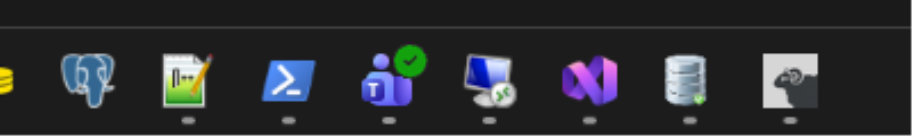

# sheepdock for Windows

The same idea as the macOS launcher, ported to Windows: herdr opens in its own
window with its own taskbar icon - one button, the ram's head, and no terminal
icon next to it. The window is a private copy of **Windows Terminal**, so text
looks exactly as it does in your regular Windows Terminal.



Rightmost: herdr, launched by sheepdock, while running. Your regular Windows
Terminal keeps its own button and icon.

No admin rights are needed. Everything is installed per user.

## Why

Windows groups taskbar buttons by *AppUserModelID*. The Store version of
Windows Terminal stamps its own fixed ID onto every window, so a herdr profile
there always shares the Windows Terminal button - or, with a shortcut carrying
that ID, pulls all your other terminal windows under the ram's head.

Microsoft also publishes Windows Terminal as a plain zip. Run unpackaged, its
windows get an ID derived from the executable's path, like any ordinary
program. So a copy of that build at its own path is, as far as the taskbar is
concerned, a separate application. Embed the herdr icon into that copy and the
window, Alt-Tab and taskbar all show the sheep, while the Windows Terminal you
use every day is never touched. It is the Windows counterpart of the copied
kitty launcher binary inside `herdr.app`.

An earlier version of this launcher used Alacritty. It worked, but Alacritty
rasterises text without ClearType and never looked like the rest of Windows;
WezTerm's FreeType rendering did not either. Windows Terminal is the only
terminal that renders text the way Windows does, because it is the one that
defines how Windows does it.

## What you get

`%LOCALAPPDATA%\Programs\sheepdock\`, about 35 MB:

- `terminal\` - Windows Terminal, unpackaged, in portable mode. Its
  `WindowsTerminal.exe` carries the herdr icon and `FileDescription = herdr`,
  so Task Manager says herdr too. `terminal\settings\settings.json` is the
  configuration for this window only.
- `herdr.ico` - built from herdr.dev's logo in all sizes the shell asks for
- `herdr-launch.ps1` - starts herdr from a shell (see below)
- `herdr.lnk` - a shortcut; a copy goes to the Start Menu
- `tools\rcedit-x64.exe` - used to embed the icon

## Requirements

- Windows 10 1903 or later, or Windows 11; PowerShell 5.1 or PowerShell 7
- [herdr](https://herdr.dev) installed (`irm https://herdr.dev/install.ps1 | iex`)
- Python 3 with Pillow for the icon (`python -m pip install --user pillow`),
  or [uv](https://docs.astral.sh/uv/) which fetches Pillow on the fly. Without
  either, the 32 px favicon from herdr.dev is used and looks soft in the taskbar.

Windows Terminal need not be installed. The installer downloads the unpackaged
build straight from the Windows Terminal GitHub release.

## Install

```powershell
git clone https://github.com/ralfkuh-lab/sheepdock.git
cd sheepdock\windows
.\install.ps1
```

Then start herdr from the Start Menu. To pin it, right-click its taskbar
button while it runs, or right-click the Start Menu entry, and choose "Pin to
taskbar". Both work: the shortcut has no arguments, because the configuration
lives inside the terminal folder.

Options:

| Parameter | Meaning |
| --- | --- |
| `-Prefix DIR` | install somewhere other than `%LOCALAPPDATA%\Programs\sheepdock` |
| `-Icon SRC` | use a different logo (URL or local image) |
| `-TerminalVersion X.Y.Z.W` | download a different Windows Terminal release (default 1.24.11911.0) |
| `-Force` | replace an existing `settings.json` of the terminal copy |
| `-NoStartMenu` | skip the Start Menu entry |

If PowerShell refuses to run the script, start it with
`powershell -ExecutionPolicy Bypass -File .\install.ps1`.

## How it works

An empty file named `.portable` next to `WindowsTerminal.exe` switches Windows
Terminal to portable mode: settings and state live in `.\settings`, and nothing
is written to the places your regular Windows Terminal uses. The installed
`settings.json` defines one profile, `herdr`, and makes it the default:

```json
"commandline": "C:\\Users\\you\\AppData\\Local\\Programs\\Herdr\\bin\\herdr.exe",
"closeOnExit": "always"
```

Closing herdr closes the window; the tab bar is hidden because herdr draws its
own tabs and panes. herdr sets the window title to the active workspace.

Three details worth knowing:

**herdr refuses to run nested.** Started from inside a herdr pane the process
inherits that pane's `HERDR_*` variables and herdr aborts with *"nested herdr is
disabled by default"*. `herdr-launch.ps1` drops them before starting the
window. From the taskbar there is nothing to drop.

**Fonts.** The installer picks JetBrainsMono Nerd Font Mono when it is
installed (its DirectWrite family name is `JetBrainsMono NFM`), else Cascadia
Mono, which ships inside the terminal folder. Line height is tuned with
`"cellHeight": "1.2"` inside the `font` object. Everything else - colour
schemes, key bindings, Ctrl+V - is plain Windows Terminal configuration; the
[settings documentation](https://aka.ms/terminal-documentation) applies as is.
Edit `terminal\settings\settings.json`, the window reloads it live.

**Updating means re-running `install.ps1`.** It downloads the release given by
`-TerminalVersion`, replaces the terminal folder, brands the new exe and keeps
your `settings` folder. Windows Terminal's own update channel is not involved,
because the copy is unpackaged.

## Starting from a shell

`herdr-launch.ps1` takes the same arguments as herdr and opens them in a new
window:

```powershell
& "$env:LOCALAPPDATA\Programs\sheepdock\herdr-launch.ps1" --session scratch
```

From Git Bash:

```sh
pwsh -File "$LOCALAPPDATA/Programs/sheepdock/herdr-launch.ps1"
```

## What it does not touch

Your regular Windows Terminal keeps working as before, including any herdr you
start there, and its settings are separate. herdr itself is not modified; the
launcher only points at its executable.

## Caveats

The Windows Terminal zip is downloaded without a signature check; the installer
prints its SHA-256 so you can compare it against the release page.

herdr's pane shells are unaffected by all of this. If you use Git Bash as the
pane shell, that stays Git Bash.

## Uninstall

```powershell
.\uninstall.ps1
```

Removes the terminal copy with its settings, the icon, the launcher and the
shortcuts, plus anything left from the earlier Alacritty-based launcher. A
taskbar pin becomes dead after uninstalling; right-click it and unpin.
